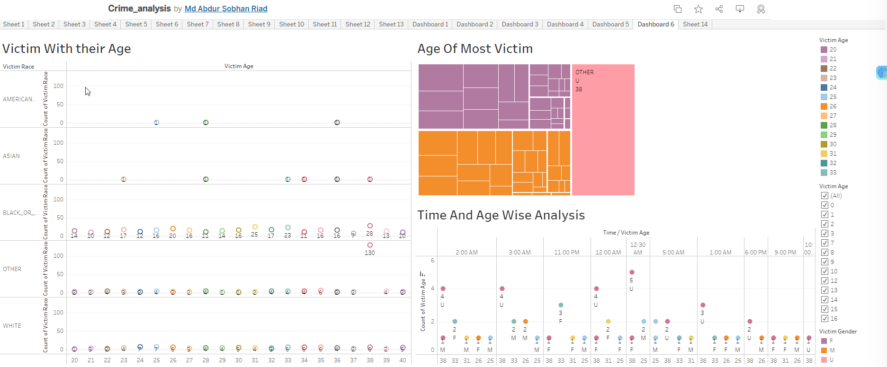

# Crime_Data_Analysis
## Project Description
The aim of this project is to analyze crime data from the year 2023 in Baltimore City, Maryland, USA, in order to gain insights, identify patterns, understand the characteristics of victims, and examine the relationship between crime and other features.

## Objectives:

1. Web Scraping and Data Collection: I have taken data from [this website](https://data.baltimorecity.gov/datasets/baltimore::part-1-crime-data/about) and scraped 1000 data.
2. Data Preprocessing: Clean and preprocess the scraped data to handle missing values and other preprocessing step.

3. Visualization: Utilize Tableau to create interactive visualizations. Generate pie charts, bar charts, maps and many more to highlight crime patterns, trends, and correlations within the dataset. Here is my [dashboard](https://public.tableau.com/app/profile/md.abdur.sobhan.riad/viz/Crime_analysis_16873409234090/Dashboard1?publish=yes
).


 


## Findings and Observations from the [Dashboard](https://public.tableau.com/app/profile/md.abdur.sobhan.riad/viz/Crime_analysis_16873409234090/Dashboard1?publish=yes).

1. The most occurring crime is Common assault and the second most is Auto theft.
2. Most of the victim age range in between 30-40.
3. Most of the victim race are Black and African American.

## Build from Sources
1.Clone the repository.
```beshv
git clone https://github.com/riad5089/Crime-data-analysis.git
```
2.Install dependencies
```bash
pip freeze > requirements.txt
```

