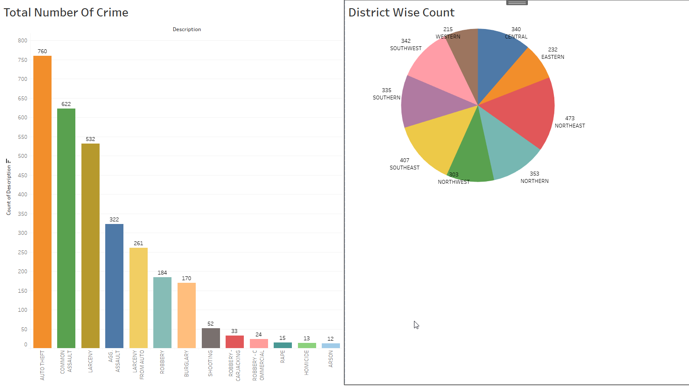
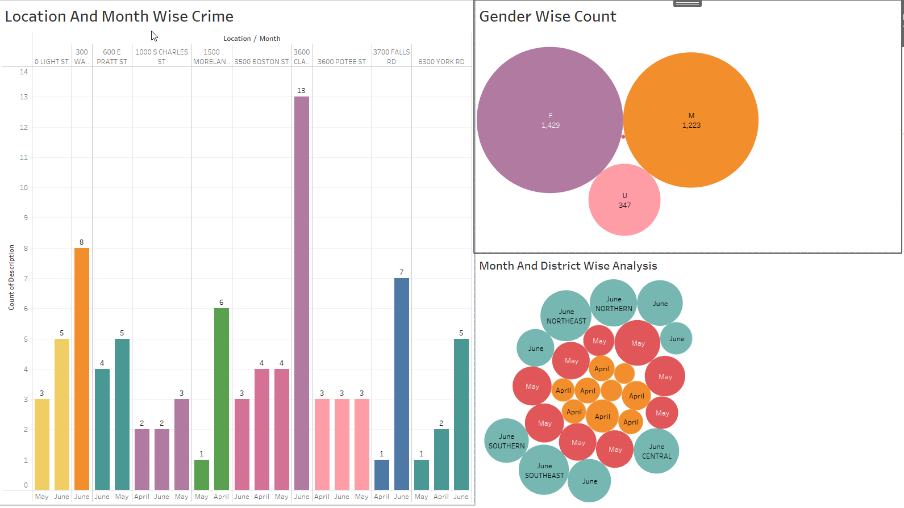
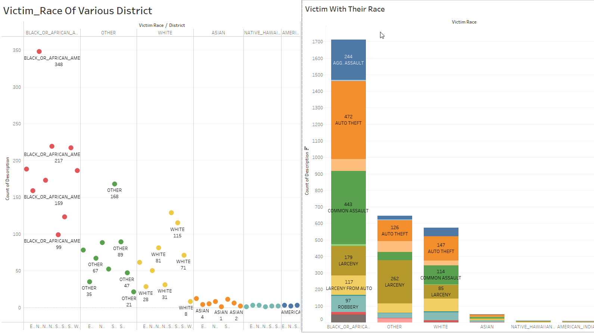
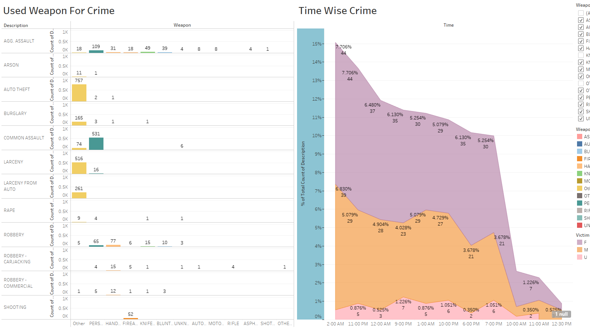

# Crime-Data-Analysis-Of-Baltimore-City-USA
## Project Description
The aim of this project is to analyze crime data from the year 2023 in Baltimore City, Maryland, USA, in order to gain insights, identify patterns, understand the characteristics of victims, and examine the relationship between crime and other features.

## Objectives:

1. Web Scraping and Data Collection: I have taken data from [this website](https://data.baltimorecity.gov/datasets/baltimore::part-1-crime-data/about) and scraped 1000 data.
2. Data Preprocessing: Clean and preprocess the scraped data to handle missing values and other preprocessing step.

3. Visualization: Utilize Tableau to create interactive visualizations. Generate pie charts, bar charts, maps and many more to highlight crime patterns, trends, and correlations within the dataset. Here is my [dashboard](https://public.tableau.com/app/profile/md.abdur.sobhan.riad/viz/Crime_analysis_16873409234090/Dashboard1?publish=yes
).

## Tableau Dashboard
1.`Total Counts` shows total number of crime and district-wise counts. Here The Total Number of Crime analysis provides an overview of the overall crime incidents recorded and District wise Count analysis represents crime incidents based on geographical districts.


2.`Crime Insights` shows Location and Month-Wise Crime, Gender-wise count and Month and District-wise analysis. Location and Month-Wise Crime Analysis" simplifies crime patterns by examining where and when crimes occur and this analysis reveals trends over different months in various locations. The Gender-Wise Analysis presents the distribution of crime victims based on gender, highlighting the number of incidents involving males and females. The Month and District-wise Analysis represent crime incidents in different districts and months.


3.`Race wise analysis` shows Victim_Race Of Various District and Victim With Their Race(according to description). The Victim Race of Various Districts analysis shows the racial composition of crime victims across different geographical districts. The Victim with Their Race analysis delves into the relationship between crime incidents and the racial identity of the victims. 


4.`Weapon and Time Wise Analysis` shows Used Weapon For Crime and Time Wise Crime. The Used Weapon for Crime analysis investigates the types of weapons involved in criminal activities. The Time-Wise Crime analysis represents  crime patterns over different time periods.


5.`Day and Map Wise Crime` 

## Findings and Observations from the [Dashboard](https://public.tableau.com/app/profile/md.abdur.sobhan.riad/viz/Crime_analysis_16873409234090/Dashboard1?publish=yes).

1. The most occurring crime is Common assault and the second most is Auto theft.
2. Most of the victim age range in between 30-40.
3. Most of the victim races are Black and African American.

## Build from Sources
1.Clone the repository.
```beshv
git clone https://github.com/riad5089/Crime-data-analysis.git
```
2.Install dependencies
```bash
pip freeze > requirements.txt
```
3.Download chrome webdriver from https://chromedriver.chromium.org/downloads

4.Run the scraper
```bash
Python files/crime_data.py --chromedriver_path <path_to_chromedriver>
```
5.You will get a file named Crime_data.csv containing all the required fields. Alternatively, check my scraped data here: https://github.com/riad5089/Crime-Data-Analysis-Of-Baltimore-City-USA/blob/main/Dataset/Scraped_data(Crime_analysis).csv.


